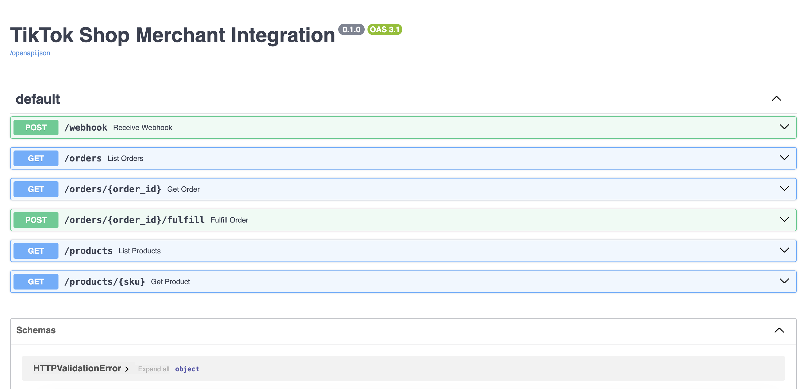
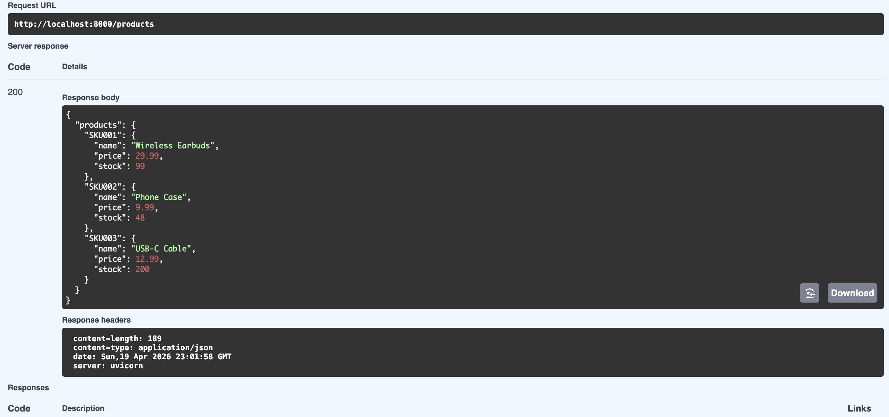

# TikTok Shop Webhook Integration — Simulation Project

## Overview

This project is a **local simulation** of how a merchant or ISV would integrate with TikTok Shop using webhooks and REST APIs. It does not connect to the real TikTok Shop platform — both sides (TikTok Shop and the merchant server) run on your laptop, so you can learn and demo the integration pattern without needing real credentials.

| File | Simulates |
|---|---|
| `main.py` | The merchant server — receives webhook events, exposes a REST API |
| `simulator.py` | TikTok Shop's servers — sends signed webhook events |
| `requirements.txt` | Python dependencies |

---

## What is a Webhook?

**Normal API — you ask, server answers:**
```
You → "give me order status" → TikTok Shop → "here it is"
```

**Webhook — server calls you when something happens:**
```
TikTok Shop → "order just got paid, here's the data" → Your server
```

Instead of your server polling every few seconds, TikTok Shop pushes data to you the moment an event occurs. This is how real e-commerce platforms (TikTok Shop, Shopify, Stripe) notify merchants of orders, payments, and inventory changes.

**Analogy:** Like signing up for shipping notifications — the shop contacts you when your package moves, instead of you checking the website every hour.

---

## What This Simulates vs. Reality

| This Project | Real TikTok Shop Integration |
|---|---|
| `simulator.py` sends events | TikTok Shop's servers send events |
| `http://localhost:8000/webhook` | Your public server URL registered in TikTok Shop developer portal |
| Hardcoded secret key | App secret from TikTok Shop developer credentials |
| In-memory `orders = {}` | Real database (PostgreSQL, DynamoDB, etc.) |

To connect to the real TikTok Shop API you would need a TikTok Shop developer account, real API credentials, and a public URL for TikTok to POST webhooks to.

---

## The Full Order Journey

### Step 1 — Order is created (simulator.py)

```python
send_event("order.created", {
    "order_id": "ORD-001",
    "customer": {"name": "Alice Chen"},
    "items": [...],
    "total": 49.97,
})
```

In production, this fires inside TikTok Shop's servers when a customer clicks Buy. The simulator replays that same behavior locally.

### Step 2 — Simulator signs and POSTs it

```python
payload   = json.dumps({...}).encode()
signature = hmac.new(secret, payload).hexdigest()

httpx.post("http://localhost:8000/webhook",
    content=payload,
    headers={"X-TikTok-Signature": signature}
)
```

A plain HTTP POST request — the same mechanism TikTok Shop uses to deliver events to merchant servers worldwide.

### Step 3 — main.py receives the event

FastAPI is always listening. When the POST arrives:

```python
@app.post("/webhook")
async def receive_webhook(request, x_tiktok_signature):
    payload    = await request.body()   # read raw bytes
    event      = json.loads(payload)    # bytes → dict
    event_type = event["type"]          # e.g. "order.created"
    data       = event["data"]          # order details
```

### Step 4 — Data is stored

```python
orders = {}  # in-memory store at the top of main.py

orders["ORD-001"] = {
    "order_id": "ORD-001",
    "status":   "pending",
    "items":    [...],
    "total":    49.97,
}
```

`orders` lives in RAM — restarting the server clears it. In production this would be a real database.

---

## End-to-End Flow

```
simulator.py                         main.py
──────────────────────────────────────────────────────────
send_event("order.created")
  │
  │  HTTP POST /webhook
  │  body:   { type, data }
  │  header: X-TikTok-Signature
  └──────────────────────────────► receive_webhook()
                                       verify signature ✓
                                       parse event type
                                       orders["ORD-001"] = {...}
                                                   │
                                                   ▼
                                            orders = {
                                              "ORD-001": {
                                                status: "pending"
                                                items:  [...]
                                              }
                                            }
```

---

## Webhook Signature Verification

Anyone on the internet can POST to your `/webhook` URL. The signature proves the request actually came from TikTok Shop and the payload was not tampered with.

**How it works:**
1. TikTok Shop and your server share a secret key
2. TikTok Shop signs the payload: `HMAC-SHA256(secret, payload)`
3. Your server recomputes the same signature and compares
4. If they don't match → reject with `401 Unauthorized`

```python
def verify_signature(payload, signature, secret):
    expected = hmac.new(secret.encode(), payload, hashlib.sha256).hexdigest()
    return hmac.compare_digest(expected, signature)
```

---

## Order Lifecycle

```
order.created  →  order.paid  →  POST /fulfill  →  fulfilled
                  │
                  └─ inventory auto-deducted on payment

order.created  →  order.cancelled
```

Each event carries a JSON `data` blob. The server reacts differently per `event_type`:

```python
if event_type == "order.created":     # store new order, status = pending
elif event_type == "order.paid":      # status = paid, deduct inventory
elif event_type == "order.cancelled": # status = cancelled
elif event_type == "inventory.low":   # log stock alert
```

---

## REST API Endpoints

| Method | Path | What it does |
|---|---|---|
| `POST` | `/webhook` | Receive events from TikTok Shop |
| `GET` | `/orders` | List all orders (filter by `?status=paid`) |
| `GET` | `/orders/{id}` | Get one order |
| `POST` | `/orders/{id}/fulfill` | Mark a paid order as fulfilled |
| `GET` | `/products` | List all products + stock levels |
| `GET` | `/products/{sku}` | Get one product |

Interactive docs: `http://localhost:8000/docs`

### API Docs Overview


### GET /products — Live Response


---

## How to Run

```bash
# Terminal 1 — start the merchant server
pip install -r requirements.txt
python main.py

# Terminal 2 — simulate TikTok Shop sending events
python simulator.py
```
